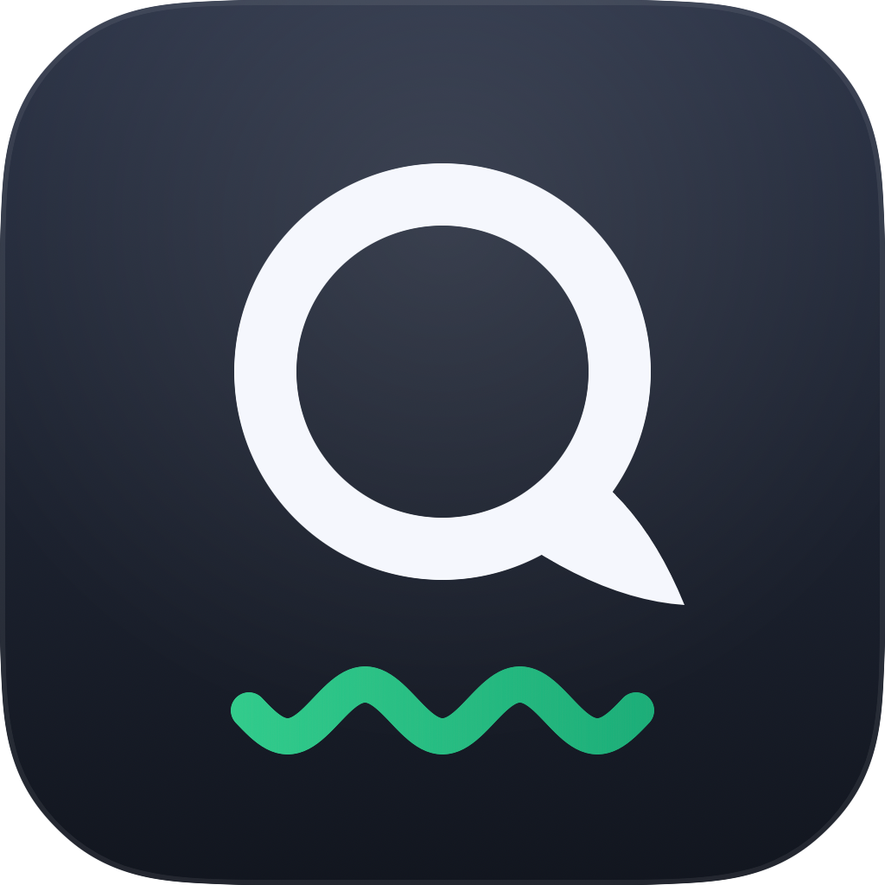

<p align="center">
  
</p>

<h1 align="center">Quill</h1>

<p align="center">A Grammarly-style writing assistant for macOS that runs entirely on-device with Apple Intelligence.</p>

Quill sits in your menu bar and works in every app. Select a sentence and a card appears with the corrected version. Keep typing and a small badge counts the issues in the field. Click Accept and the text is replaced in place. Nothing ever leaves your Mac.

## Features

- **Selection check**: select text anywhere, get an instant spinner, then a card with the correction highlighted. Accept replaces the selection in place.
- **Badge mode**: while you type, Quill checks the whole field on pause and docks a red issue-count badge at the field's corner. Click it to review and accept all fixes.
- **Rephrase and Improve**: one click on any card (or on the "Looks good" pill) rewrites the text on-device.
- **Everywhere by default**: native apps, Electron apps, and browsers (Chromium's accessibility tree is switched on automatically). Per-app disable list and a global pause live in the menu bar.
- **Private by construction**: the only model is Apple's on-device Foundation Model. No accounts, no API keys, no telemetry, no network.

## Requirements

- Apple Silicon Mac
- macOS 26 (Tahoe) or later with Apple Intelligence enabled
- Xcode 26 command line tools to build

## Install

### Download (recommended)

1. Grab the latest `Quill-x.y.z.dmg` from the [Releases page](https://github.com/Sriram-52/quill-mac/releases).
2. Open the DMG and drag `Quill` to Applications.
3. The build is not notarized, so clear the quarantine flag once:
   `xattr -dr com.apple.quarantine /Applications/Quill.app` (or right-click the app and choose Open).
4. Launch Quill and grant Accessibility permission when prompted
   (System Settings > Privacy & Security > Accessibility > enable Quill).

Quill is menu-bar only (pencil icon), with no Dock icon. New versions appear on
the Releases page; download and replace the app to update. If Quill then shows
"Waiting for Accessibility permission", the old grant is stale: remove Quill from
the Accessibility list (−), relaunch, and grant again.

### Build from source

```sh
git clone https://github.com/Sriram-52/quill-mac.git
cd quill-mac
scripts/make-app.sh
open /Applications/Quill.app
```

`scripts/make-app.sh` builds, signs (ad-hoc), and installs to `/Applications`.
Pass `--no-install` to only produce `build/Quill.app`. macOS may drop the
Accessibility grant after a rebuild; remove and re-add Quill in that list if
selections stop reacting.

## How it works

1. An `AXObserver` follows the frontmost app and listens for selection, focus, and value changes through the Accessibility API.
2. Selected or typed text goes to Apple's Foundation Models framework with guided generation, so the model returns exactly one corrected string and no commentary.
3. A word-level diff is computed locally. The model is never trusted with character offsets. Punctuation-only normalizations (em dash to `--`, curly quotes to straight) are filtered out so they never appear as suggestions.
4. A non-activating floating panel shows the result near the selection without stealing focus.
5. Accept writes the text back through the Accessibility API, with a clipboard-paste fallback for apps that ignore it (most Electron apps).

## Where Quill checks

Multi-line editors and rich-text areas are checked by default. Single-line text
fields and combo boxes are not: an address bar, a login box, a search field and
a form input are all the same accessibility role, and a card over any of them is
noise. If an app's real writing happens on one line, turn it on with **Check
Single-Line Fields in <app>** in the menu bar.

Fields whose accessibility name looks like a credential or a payment detail are
never checked, in any app. Names that merely look like a form field (`email`,
`phone`, `sign in`, `to`) are refused on single-line fields only.

For finer control, drop a `FieldPolicy.json` in
`~/Library/Application Support/Quill/`:

```json
[
  { "bundleID": "^com\\.example\\.app$",
    "elementName": "^title$",
    "allowSingleLine": true,
    "notes": "Titles are the whole document here" }
]
```

`bundleID` and `elementName` are case-insensitive regexes; omit either to match
anything. `ignoreNameBlocklist` re-enables a surface the blocklist wrongly
refuses, and `"isEnabled": false` refuses one outright. A malformed file is
ignored with a note in the log.

## Limitations

- Google Docs draws text on a canvas and exposes nothing to the Accessibility API. No AX-based tool can work there.
- Some rich in-page editors hide their text from the Accessibility API; badge mode may not trigger in them even when selection mode works.
- The on-device model is small (about 3B parameters). Corrections are good, not Grammarly Premium. Rewrites can be uneven; re-click for another take.
- Fields over 3000 characters are skipped by badge mode for now.

## Project layout

```
Sources/Quill/
  AppDelegate.swift        wires everything together
  SelectionWatcher.swift   AXObserver, debounced selection and typing events
  AXSupport.swift          Accessibility helpers, field surface classification
  FieldPolicy.swift        which fields get checked: roles, rules, name blocklist
  TextReplacer.swift       in-place replacement with paste fallback
  Engines/                 WritingEngine protocol + FoundationModelsEngine
  Diff/WordDiff.swift      word-level LCS diff and highlighting
  UI/                      suggestion panel, card, badge
scripts/make-app.sh        build, bundle, sign, install to /Applications
scripts/check-policy.sh    offline checks for the FieldPolicy decision table
scripts/render-icon.swift  renders the app icon with SwiftUI
```

`DESIGN.md` records the product and architecture decisions.

## License

MIT. See `LICENSE`.
